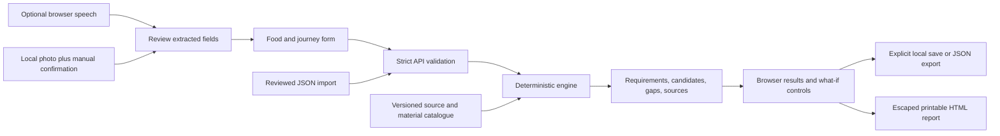

# Implemented architecture

## System boundary

Packora is a loopback web application. React renders the workflow and stores explicitly saved results in this browser. FastAPI loads a small versioned catalogue and runs a deterministic Python engine. The browser and API share an origin when using the built app. No cloud database, deployment, user account or LLM credential is needed.

## Code responsibilities

| Module | Responsibility |
|---|---|
| `backend/models.py` | Strict units in names, supported enums, finite numeric bounds, forbidden extra keys, stage constraints and relational validation. |
| `backend/data/catalog.json` | Four commodity entries, seven material families and seven source annotations; sparse quantitative coverage is explicit. |
| `backend/engine.py` | Mode routing; range calculations; journey aggregation; missing/conditional/infeasible statuses; ordinal family ordering; reproducible result identity. |
| `backend/main.py` | Request limits, schema errors without echoing input, local host validation, serving assets, and public read/evaluate/report endpoints. |
| `backend/reports.py` | Self-contained escaped HTML with complete inputs, equations, assumptions and sources. Browser printing can create a PDF when requested. |
| `frontend/src/App.tsx` | Current scenario/result state; request revision ownership; navigation; explicit browser persistence and notifications. |
| `Planner.tsx` / `Results.tsx` | Progressive input and technical explanation; what-if controls use the real API. |
| `Navigation.tsx` | Native-dialog orbit menu, rotation, keyboard/touch/list alternatives. |
| `InputDialog.tsx` | Bounded import, optional browser speech, narrow phrase matching and local photo confirmation. |
| `storage.ts` | Checks stored snapshot structure before rendering; preserves unreadable raw storage until an explicit later write. |

## Version and state rules

Input is normalized through the server model. Fingerprints include the full canonical scenario, engine version, and catalogue-content hash. Identical input under identical versions gives identical output. A newer engine can yield a different fingerprint even if inputs remain unchanged. The hash is a reproducibility aid, not a food-safety attestation.

Saved entries are snapshots, not automatically recomputed current recommendations. Up to twenty recent plans are retained. Export JSON to keep older work beyond that limit. Opening a snapshot discloses its status; edit/recalculate to use current evidence. Printable-report requests include the expected fingerprint. If the server would silently change the underlying result, it rejects the report with HTTP 409 and asks for explicit recalculation.

Each request owns the current editor revision. Editing or navigating invalidates older in-flight requests. A late response cannot overwrite the current draft. API failures remain visible and retryable; exports and save notifications only claim success after the relevant operation succeeds.

## Privacy and security choices

Images stay in object URLs in browser memory and are released when the dialog closes. Packora does not upload or retain photos/audio. Browser speech may contact the browser vendor's service; it starts only on a user gesture and is disclosed before use. Raw scientific evaluation inputs are not sent to any external service.

JSON bodies are limited to 64 KB, including streamed requests. Source URLs come from the curated catalogue. Imported text is rendered as text, not executable HTML. Reports escape user-controlled values. HTML/JS assets are bounded to the build directory; traversal and unknown API paths are rejected. Local host validation and CSP reduce accidental exposure. Production authentication, authorization, rate limiting and threat modelling are separate future deployment work, not silently assumed solved.

## What is deliberately absent

No trained shelf-life predictor, active gas-flush prescription, chemical measurement from photographs, lab-calibrated confidence probability, validated finished-film matching, numerical cost/LCA optimum, live traffic feed, background cloud sync or deployment. These are documented extension points, not disabled controls pretending to be implemented features.
